# Results

For reference, information about each gemm can be found here:

* [GEMM Implementations](./src/gemms/README.md)

## Naive vs. cache-aware orderings

As expected, we find that suboptimal index orderings perform much worse. Below is a comparison of Reordered, Naive and Multithreaded_c. The numbers below were crunched on 1024x1024 matrices:

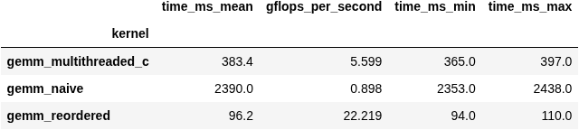

Unsurprisingly, Reordered crushes Naive. Yet it also crushes Multithreaded_c - a multithreaded implementation which loops over j before k. This underlines the significance of cache misses to performance.

For matrices larger than 1024x1024, Reordered's performance rapidly falls off, falling to about 12 gflop/s for 2048x2048.

## Comparison of tiling strategies (single-threaded)

As expected, by tiling our matrices we gain a huge performance speed-up for larger matrices. Computing a row of the output matrix requires every element of the right matrix to be read. Through tiling, a smaller number of elements are read and used at a time, reducing cache misses.

We have two tiling implementations: Tiled_a which computes tiles sequentially, and Tiled_b which computes them recursively.

### Tile Size

We begin by tuning our parameter sizes on a square 2048x2048 matrix:

#### <u>Tiled_a parameters</u>

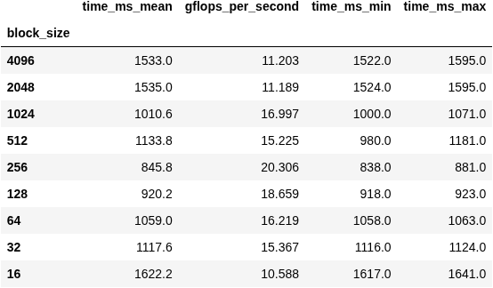

#### <u>Tiled_B parameters</u>

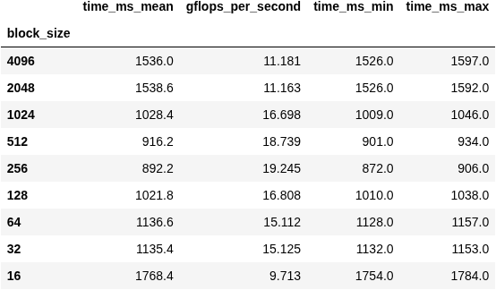

We find that 256 is the best size, at least for floats. 256 * 256 * 4 bytes is ~260KiB. So the combined 3 tiles are ~785KiB. This fits into approximately one of my 1.2MiB L2 caches on my i5-12450H processor performance core. My L1 caches only have 40KiB of memory. In other words, the processor is performing best when optimizing tile size for L2 rather than L1! It seems the difference in read-time is not enough to justify the tile overhead of L1.

* **Investigation idea:** *We can use perf to compare cache misses on smaller tile sizes (32 or 64) with 256. Less L1 misses at smaller tile sizes would confirm the overhead of smaller tiles is outweighing the gain of fewer misses at these tile sizes.*

I was also suprised by the lack of any real performance improvement of Tiled_b over Tiled_a. I expected Tiled_b to be faster because its recursive calls should be better suited to exploiting multiple cache layers. But we can see from the tables Tiled_a is consistently faster at different tile sizes, at least for 2048x2048 matrices.

That said, the tiling seems to optimize better for L2, so the recursive approach has less value with less layers of cache to optimize for.

* **Investigation idea:** *Since the cache sizes are not powers of 2, can our tiling algorithms show better performance with a tile-size between powers of 2 for large square matrices?*

### Performance on non-square matrices

I was particularly interested in how performance might degrade on non-square matrices. By reducing the width of the output matrix (and hence width of the right), the height of the output matrix (and hence height of the left), and the "ksize" of my left/right matrices (i.e. width of left, height of right), I generate 3 charts of gflop/s for different matrix dimensions on my single-threaded GEMMs:

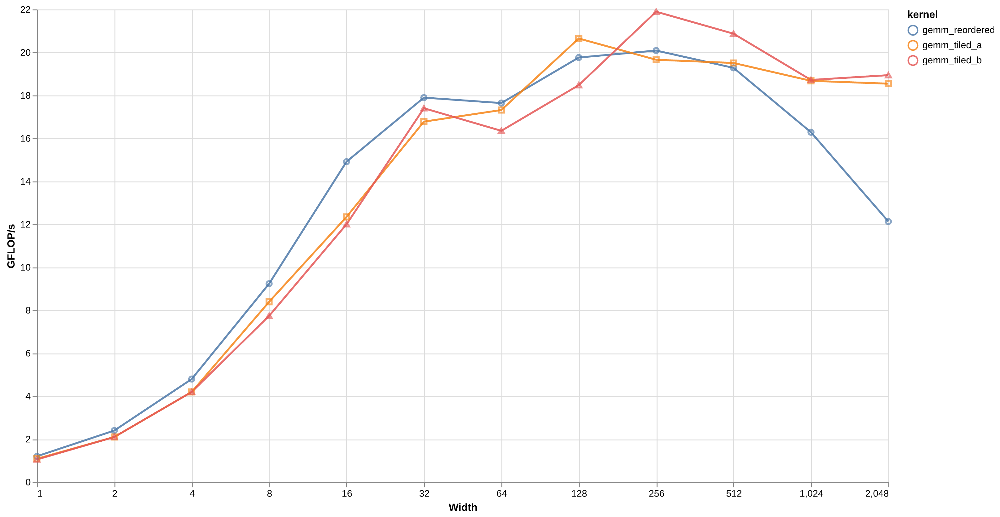

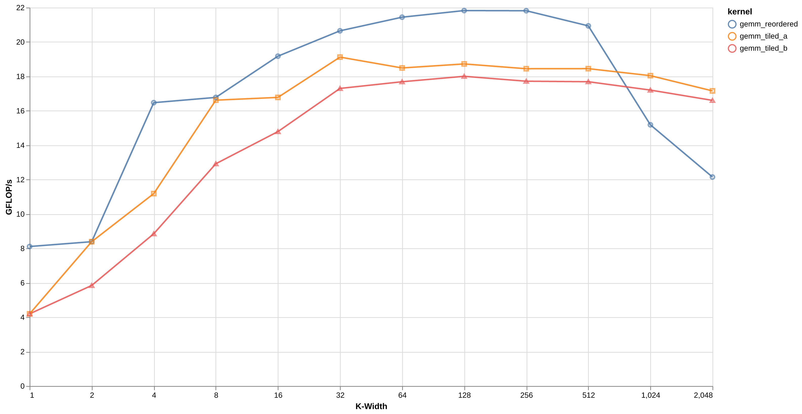

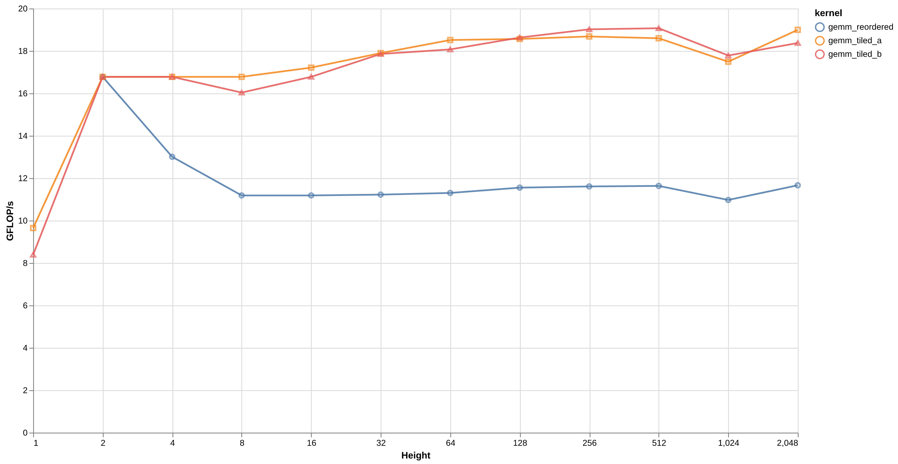

Strikingly, we see that reordered keeps pace with (and even beats) Tiled_a and Tiled_b when we shrink the width and the ksize! With a bit of thought, this makes perfect sense. Tiling maintains performance because a row of the output requires the entirety of the right matrix. But if we shrink the width or height of the right matrix, this argument becomes less salient. Yet the argument still applies if we change the height of the output (and left) matrices. And so in this case tiling consistently outperforms.

This suggests an assymetry - the tiling of the right matrix is more important for maintaining performance than the tiling of the left and output matrices.

* **Investigation idea:** *How does the situation change if two dimensions are reduced simultaneously i.e. width and height, or height and ksize?*

* **Investigation idea:** *Are different tile-sizes more performant for non-square matrices of various dimensions? Is there valid grounds for having distinct tile sizes for each of i, j and k?*

## Comparison of tiling strategies (multi-threaded)

**Note:** *There is no way of fairly extrapolating the comparison of tiling vs no-tiling to a multi-threaded context. Multithreading over i and j is trivial in the tiling context, but since j is in the inner loop of reordered, we would either have to keep the same index order and parallelize over i and k (requiring atomics) or reorder the indices (like Multithreaded_c). As previously seen, any reordering of the indices unsalvagably destroys performance.*

Similarly to Tiled_a and Tiled_b, Multithreaded_a corresponds to a direct tiling strategy, whereas Multithreaded_b is recursive.

### Tile Size / Thread Number

Like before, we begin by finding optimal parameters for Multithreaded_a and Multithreaded_b. Since there's now two parameters, we require a grid search:

#### <u>Multithreaded_a parameters</u>

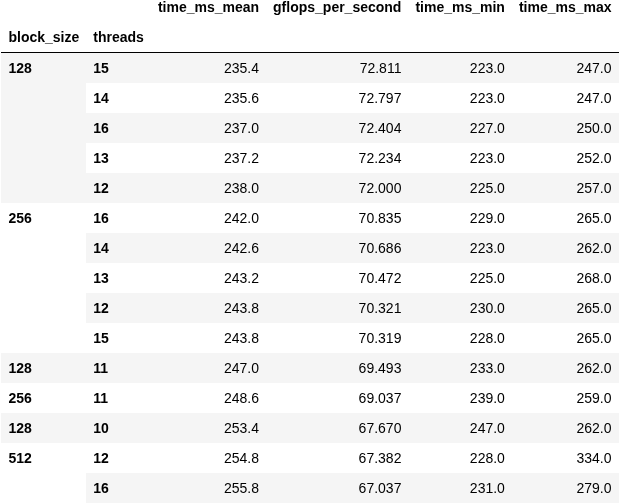

#### <u>Multithreaded_b parameters</u>

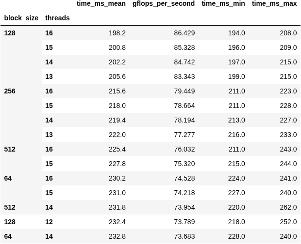

Immediately, we are greeted by another suprising result. My i5-12450H processor has 4 performance cores, each with 2 threads, and 4 efficiency cores, each with 1 thread, for a total of 12 hardware threads. I would have expected the optimal thread count to be between 8 and 12. Yet we find performance increasing for as many as 16 software threads!

The most likely theory for this is the operating system's scheduler. Perhaps more threads indirectly encourages the scheduler to spend more time on my compute versus background processes.

* **Investigation idea:** *These tests are running on my linux mint gaming laptop, but I happen to have a headless arch server (I use arch btw). Would performing the tests there yield more predictable results in terms of optimal thread numbers?*

Otherwise, we see that the recursive tiling strategy is at least partially vindicated in the multi-threaded case. Compared to the single-threaded case, we have 8 times as much L1 cache to work with and 5-6 times as much L2 cache - but the same amount of L3 cache. These different ratios may shift the  balance of power towards lower cache levels and encourage optimization across multiple layers. This hypothesis is supported by the tendency towards a tile size of 128 over 256.

* **Investigation idea:** *Similarly to the single-threaded case, it would be interesting to better understand cache misses via perf.*

### Performance on non-square matrices

We run an equivalent test to the single-threaded case, shrinking the height, width and ksize respectively. Tests are computed with tile size 128 and 15 software threads.

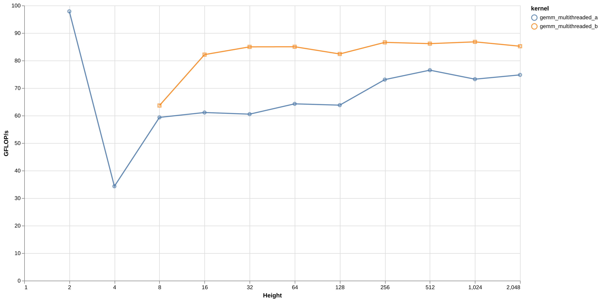

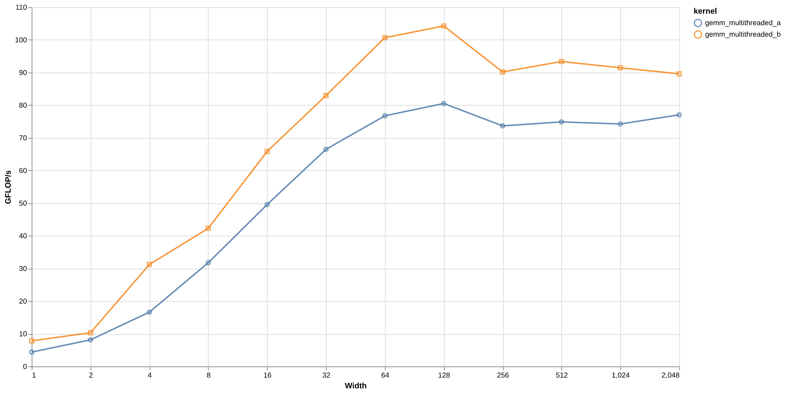

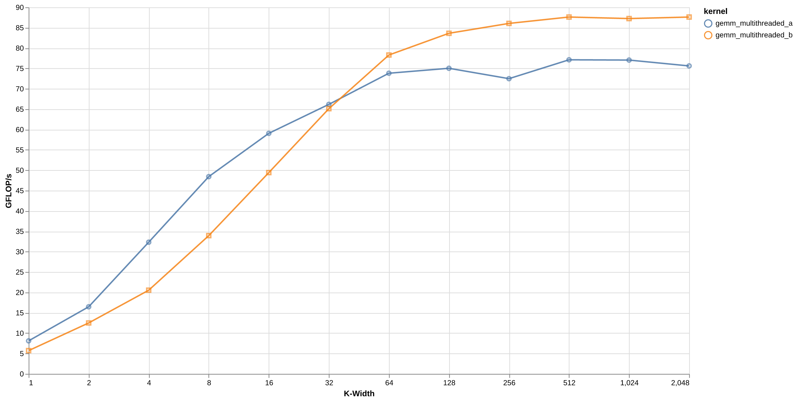

Interestingly, we see that though recursive maintains a consistent lead in most cases, it starts to fall behind for smaller ksizes. After some thought, I still can't figure out why that would be the case. Neither implementation parallelizes over k, but I'm not sure how that would affect this. Nonetheless, it's food for future investigations!

* **Investigation idea:** *Find and test a hypothesis for why Multithreaded_a outperforms Multithreaded_b on smaller ksizes!*

## Ideas for further exploration

Besides the above investigation ideas, there are a number of other topics I'd still like to explore in this topic:

* **Vectorization -** Adapt implementation for SIMD instructions to measure speedup.

* **OpenBLAS -** Compare speed against OpenBLAS implementation. Consider generalizing for alpha-beta style API.

* **Different float types -** Explore performance of different float sizes such as double, or even smaller than float if my processor supports it. Explore precision degradation.

Hope you found something interesting in here. Cheers!

### [Main README](./README.md)